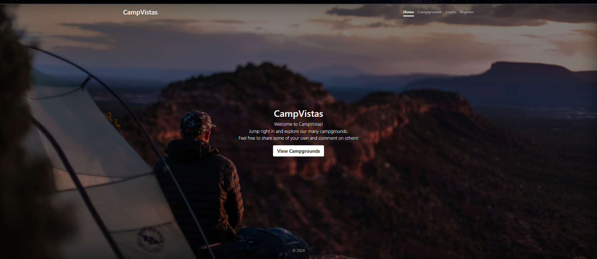

# Camp Vistas

Welcome to the Camp Vistas repository! This project is designed to provide an online platform for users to explore and book camping sites.

## Table of Contents

- [About the Project](#about-the-project)
- [Features](#features)
- [Technologies Used](#technologies-used)
- [Installation](#installation)
- [Usage](#usage)
- [Screenshots](#screenshots)

## About the Project

Camp Vistas is an online platform that allows users to explore various camping sites, read reviews, and book their stays. It is designed to make it easy for campers to find the perfect spot for their next adventure.

## Features

- User authentication and authorization
- Browse and search for camping sites
- View details and reviews for each site
- Book camping sites
- Leave reviews and ratings for visited sites

## Technologies Used

- **Front-end:**
  - HTML
  - CSS (Bootstrap)
  - JavaScript

- **Back-end:**
  - Node.js
  - Express.js

- **Database:**
  - MongoDB

## Installation

To set up the project locally, follow these steps:

1. Clone the repository:
    ```sh
    git clone https://github.com/hardikjoshi746/Camp-Vistas.git
    ```

2. Navigate to the project directory:
    ```sh
    cd Camp-Vistas
    ```

3. Install the required dependencies:
    ```sh
    npm install
    ```

4. Set up the environment variables. Create a `.env` file in the root directory and add the following:
    ```
    PORT=3000
    MONGO_URI=your_mongodb_connection_string
    SECRET=your_secret_key
    ```

5. Start the application:
    ```sh
    npm start
    ```

## Usage

Once the application is running, you can access it in your web browser at `http://localhost:3000`. From there, you can create an account, log in, browse camping sites, and make bookings.

## Screenshot



